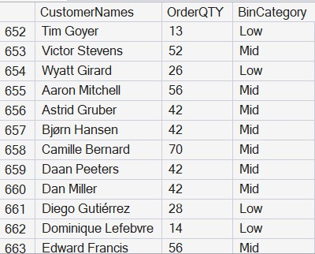

# 🎵 SQL Music Purchase Analysis

## 📌 Objective
This project analyzes customer purchasing behavior and music sales data across different countries, time periods, and customer segments using SQL.

The goal is to uncover patterns in revenue generation, customer spending habits, and sales trends.

---

## 🛠 Tools Used
- SQL (SQL Server)
- Chinook Database (Music Store Dataset)

---

## 📂 Project Structure
- `sql/` → Contains SQL queries used for analysis  
- `images/` → Contains screenshots of query results  
- `README.md` → Project documentation  

---

## 📊 Key Analysis Performed

### 1. Customer Purchase Patterns by Country
- Analyzed total spending by customers in:
  - Germany
  - USA
  - Belgium
  - India
- Identified high-value customers across regions

---

### 2. Artist Revenue by Month
- Evaluated revenue generated by artists and albums
- Focused on specific months:
  - April, June, September, December
- Helped identify seasonal sales trends

---

### 3. Customer Segmentation by Order Quantity
- Grouped customers into categories:
  - **High** → Large quantity buyers  
  - **Mid** → متوسط buyers  
  - **Low** → Small quantity buyers  
- Useful for targeted marketing and business strategy

---

### 4. Revenue Analysis by Country and Day
- Compared revenue across:
  - Sweden, USA, Italy
- Focused on weekend performance:
  - Friday, Saturday, Sunday
- Revealed peak sales periods

---

## 📸 Sample Outputs

### Customer Spending

### Artist Revenue

### Revenue by Country

### Order Quantity Distribution

---

## 💡 Key Insights

- Customers in the **USA** contribute significantly to total revenue  
- **Weekend sales (Friday–Sunday)** show stronger performance compared to weekdays  
- Certain artists and albums consistently generate higher revenue across months  
- A small group of customers falls into the **“High” purchase category**, contributing disproportionately to sales  

---

## 🚀 Conclusion
This project demonstrates how SQL can be used not just to query data, but to generate meaningful business insights.

By combining aggregation, filtering, and segmentation techniques, we can better understand customer behavior and revenue patterns.

---
